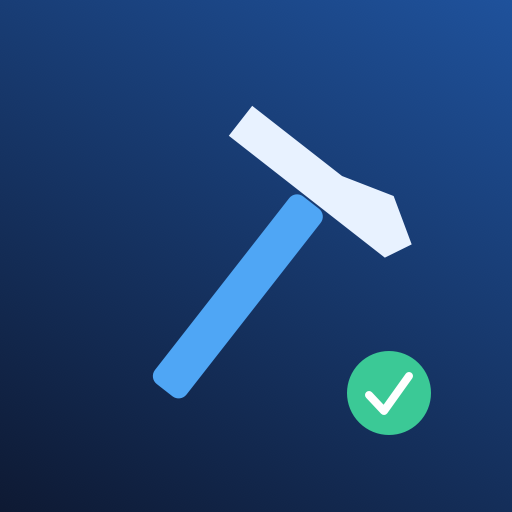

# Xcode Build Status for DynamicLake

<p align="center"></p>

A small native **DynamicLake JSON plugin** for builds started in the Xcode GUI. Start a build normally with **⌘B**, Run, Analyze or Archive. No button in the plugin, project edits, scheme scripts or per-project setup are required.

The compact activity is deliberately minimal: a blue `hammer.fill` SF Symbol on the left and DynamicLake's native circular progress on the right. A successful build replaces progress with a green native success status; a failed build uses the red failed status. Completion opens a short Sneak Peek when the host advertises that feature, then the whole activity disappears. Cancellation dismisses the activity without reporting success or failure.

Independent plugin by **Rafael Reverberi**, version **0.1.0**, identifier `com.dynamiclake.plugins.xcode-build-status`. Not affiliated with Apple or DynamicLake. It has not been submitted to DynamicLake Market.

## Requirements

- DynamicLake Pro or Playground with JSON plugin support.
- macOS 13 or newer; the package includes one universal Apple Silicon / Intel executable.
- **Xcode 27**, the version used for local build/log compatibility testing. The completion parser deliberately accepts only its observed **SLF 13** layout. Earlier or future log formats degrade to dismissal without an invented result.
- Xcode's normal DerivedData build locations. The global absolute custom DerivedData location is also discovered from Xcode preferences at startup and Xcode launch.

No Python, Homebrew, Node, Swift toolchain, external library or companion application is needed **to run the downloaded plugin**. Python 3 and Xcode Command Line Tools are needed only to build/test from source. Intel code is cross-built and packaged; Intel runtime execution still needs validation on an Intel Mac.

## Installation

Download `Xcode-Build-Status-0.1.0.zip` and its `.zip.sha256` from the [GitHub release](https://github.com/rafaelreverberi/dynamiclake-xcode-build-status/releases/tag/v0.1.0).

1. Verify the download with `shasum -a 256 -c Xcode-Build-Status-0.1.0.zip.sha256` in the download directory.
2. Extract the ZIP. It contains `XcodeBuildStatus.dynamiclakeplugin` at the top level.
3. Open DynamicLake **Settings → Plugins → Install Local** and choose that package.
4. Confirm installation and enable **Xcode Build Status**. Start an ordinary Xcode build.

The repository also includes the built package for local installation. After changing source, run the release builder before installing. DynamicLake verifies installed files, so never edit the managed installed package. Keep the same identifier when updating. GitHub's automatic source archives are distinct from the installable release ZIP.

## Settings

| Setting | Range | Default |
| --- | --- | --- |
| Success Display Duration | 1–10 sec, step 1 | 3 sec |
| Failure Display Duration | 1–10 sec, step 1 | 5 sec |

The only two custom settings are native sliders. They are read from the host's settings file. kqueue observes both the file and its parent, covering in-place changes and atomic replacement. A change affects the current completion deadline without restarting it. Malformed settings retain the last valid values; missing settings use defaults. Older hosts still receive completion Sneak Peek content on hover, but automatic presentation is omitted unless `DYNAMICLAKE_PLUGIN_FEATURES` contains `presentSneakPeek`.

## Build observation

The executable uses Foundation, AppKit's application lifecycle notifications, CoreServices FSEvents and system zlib. It connects only to the Unix socket supplied by `DYNAMICLAKE_JSON_SOCKET` and sends documented, length-prefixed JSON frames.

At startup it discovers the immediate DerivedData project directories, snapshots old manifest IDs and dismisses stale activity IDs. It watches filesystem events rather than recursively scanning the tree on a timer.

**Start:** a new generation of `Build/Intermediates.noindex/XCBuildData/build.db-journal`, confirmed by a held SQLite reserved writer lock using read-only `fcntl(F_GETLK)`. The newest `.xcbuilddata/build-request.json` identifies the request. The reader rejects command-line overrides, dry runs, index arenas, preview builds and unknown shapes. Xcode's separate `Index.noindex` build area does not start an activity. File identity and creation time distinguish rapid journal replacement even when filesystem events coalesce.

**Finish:** journal disappearance opens a bounded five-second grace period for `Logs/Build/LogStoreManifest.plist` and the corresponding completed `.xcactivitylog`. Only GUI `IDEActivityLogSection` entries with a matching build domain, UUID and time interval are accepted. Manifest status/error counts determine the result, while a narrow SLF reader checks the root cancellation flag. In observed Xcode 27 logs, a cancelled build can have a warning status in the manifest; treating that alone as success would be wrong.

**Failure detail:** the bounded gzip/SLF reader extracts a structured diagnostic message title with error severity, preferring compiler detail over a generic nonzero-exit message. It sends at most 160 sanitized characters, with absolute paths and control characters removed. It does not infer an exit code. If no reliable diagnostic is available, only “Build Failed” is shown. The documented text component provides a single center message, so the detail follows the title with a dash rather than a custom multiline view.

**Restart and cancellation:** an existing journal is adopted only when a writer lock is still held; its creation time anchors the active build and progress stays indeterminate after recovery. Old completed logs are never replayed. New work replaces the previous completion state. Each DerivedData project has one stable activity ID, so independent projects can have separate activities. Xcode termination dismisses tracked work. Disconnecting from DynamicLake exits the executable; the host removes the disconnected client's activities and owns plugin relaunch.

These are local filesystem observations, **not a public Xcode monitoring API**. They were verified against Xcode 27, but Apple can change the request, journaling or log layout. The plugin fails closed on unknown metadata. See [research and compatibility notes](docs/RESEARCH.md).

## Progress is estimated

Research did not identify a supported API for attaching to arbitrary GUI builds and reading exact live percentage without project integration or private service interception. Xcode's scripting dictionary returns results for actions a script starts; it does not provide a public percentage stream for arbitrary user-started builds. A persistent build-service process is also not proof that a build is active. Completed activity logs are result data, not a live progress API.

The first comparable build uses **native indeterminate progress**. Successful completed durations train an **EWMA with α = 0.3**. Later builds use elapsed time divided by that estimate, bucketed by a hash of project container, target IDs, configuration, action, scheme command and destination architecture/platform. Exact scheme names are not guessed. The Sneak Peek explicitly says **Estimated Progress** when a determinate estimate is shown.

Progress is monotonic, quantized to one-percent changes, updated at most once per second and capped at **95% until real completion**. Excessive historical variance or a build exceeding 2.5 times its expected duration (with a ten-second minimum) switches back to indeterminate progress. Success immediately becomes the completed native status, representing completed work. Cancellation/failure durations do not train the successful-build estimate.

Only up to 64 hashed duration buckets are stored in `~/Library/Application Support/XcodeBuildStatus/history.json`, with private file permissions and no project paths or diagnostics. Entries older than 90 days are pruned when loaded. Nothing mutable is written into the installed package.

## Privacy and performance

There are **no runtime network requests, analytics, telemetry, cloud services, source uploads, Accessibility calls, OCR, UI scraping, private framework injection or runtime shell commands**. The socket payload contains only predefined symbols/status, a progress value and a short completion/diagnostic message. Raw source, whole logs, project names, full paths and environment dumps are not sent to DynamicLake. Diagnostic titles can still contain sensitive identifiers; secret-related titles are suppressed, but nearby people can see any displayed diagnostic. Disable the plugin when that is inappropriate.

Idle observation is event driven: no repeating idle timer, no `ps` polling, no log streaming and no recursive rescan loop. Active work has a one-second progress timer. Completion uses its own precise deadline. Brief, bounded retries only occur while waiting for a finished log. Filesystem event overflow triggers one shallow rediscovery. Log reads are capped at 4 MB compressed / 16 MB expanded / 300,000 tokens; oversized or unsupported final logs cause an honest dismissal.

Local resource measurements and the distinction between mock-host and real-host evidence are recorded in [VALIDATION.md](docs/VALIDATION.md). They are observations from this machine, not guarantees for every project or Mac.

## Limitations

- Observation begins when Xcode opens the build transaction, after initial preparation. Extremely short builds may finish within an event batch and show only completion.
- Builds with custom per-project locations outside the standard/global DerivedData root, legacy build locations, WAL journaling, remote/cloud builds or unrecognized request shapes are not covered. Changing the global location while Xcode stays open requires restarting the plugin.
- Missing/oversized/unrecognized final logs dismiss after the grace period rather than displaying a false result. Very long builds have a two-hour safety ceiling.
- Completion Sneak Peek presentation can be ignored by DynamicLake when another activity currently occupies the main lake, as its API documents. Normal priority is intentional.
- A resumed build uses indeterminate progress. Historical timing is an estimate; clean, incremental, archive and target changes can vary substantially.
- Not every Xcode action/destination, Intel execution or notch/pill appearance has been tested. The exact remaining checks are in [VALIDATION.md](docs/VALIDATION.md).

## Tests and packaging

```sh
swift test
python3 -B -m unittest discover -s Tests -v
python3 -B scripts/build_release.py
cd dist
shasum -a 256 -c Xcode-Build-Status-0.1.0.zip.sha256
```

The Swift tests cover settings, EWMA, progress bounds/monotonicity, completion/expiry, stale and duplicate events, rapid builds, cancellation, native components, feature detection, framing, privacy, manifest/request parsing and malformed/UTF-8 SLF data. Native runtime tests cover atomic/in-place settings observation, journal identity and bounded reads. Tests do not need Xcode to be building. Python tests exercise manifest and archive rejection rules.

The release builder runs both suites, cross-builds a universal optimized executable, strips debug information, applies an ad-hoc signature, verifies architecture/signature/permissions, validates the manifest, settings, changelog, PNG dimensions and official size limits, then validates ZIP integrity/top-level structure and executable-bit retention. It writes `dist/Xcode-Build-Status-0.1.0.zip` and its SHA-256 file. The binary is ad-hoc signed, not Developer ID signed or notarized. macOS CI runs the same build and checksum checks with read-only repository permissions.

See [RELEASING.md](RELEASING.md), [SECURITY.md](SECURITY.md), [CHANGELOG.md](CHANGELOG.md) and [ASSETS.md](ASSETS.md). This repository does not grant a source license, following the reference plugin's current distribution posture. It is public for review; a future Market submission would need a separate decision about its open-source requirement.
